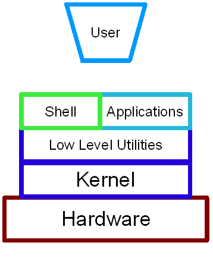
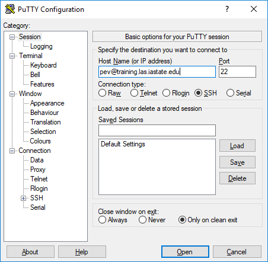
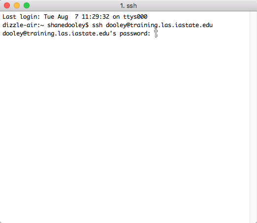
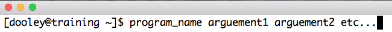
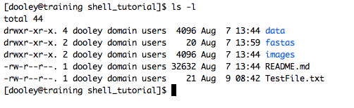
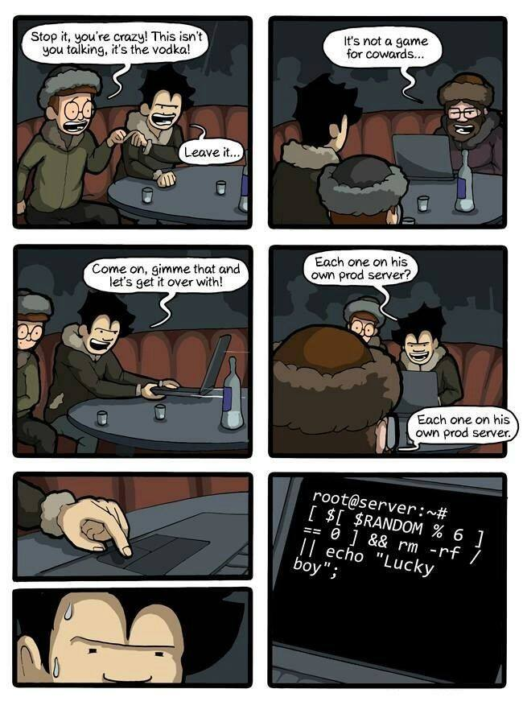
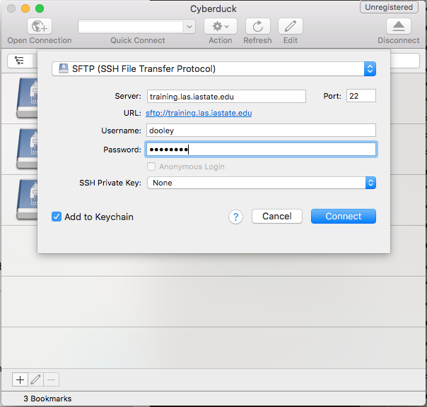

# The Shell

**Original Material by Milad Fatenejad, Sasha Wood, and Radhika Khetani**
**Modified by Jared Flater and Adina Howe**

**Remodified by Shane K. Dooley**

# Getting Started

In order to prepare for this tutorial please do the following **before** class:

If your laptop runs Windows:
1. Download the [Putty](https://www.chiark.greenend.org.uk/~sgtatham/putty/latest.html) excecutable

2. Download & Install [WinSCP](https://winscp.net/eng/download.php)
3. Download & Install [Notepad++](https://notepad-plus-plus.org/download/)

If your laptop runs MacOSX or Linux:
1. Download & Install [Cyberduck](https://cyberduck.io/)
2. Download & Install a text editor (you can use the built in editor but we recommend either [Sublime](https://www.sublimetext.com/) or [TextWrangler](https://itunes.apple.com/us/app/textwrangler/id404010395?mt=12))

# Fundamentals
## What is "shell"?

The **shell** is a program that allows users to talk to the operating system
of a computer or group of cumputers (cluster) by typing in recognized commands (**command line interface**)
to run programs instead of controlling what the computer does using a **g**raphical 
**u**ser **i**nterface (GUI) with a mouse/keyboard combination.

A **terminal** is a program you run that gives you access to the
shell. There are many different terminal programs that vary across
operating systems. Today, if you are using Windows you will use the Putty terminal
and if you are using a Mac or have Linux running on your laptop, you will be using
the well named program Terminal as your terminal.

There are many reasons to learn about the shell. In our opinion, the
most important reasons are that:

1.  It is very common to encounter the shell and
    command-line-interfaces in scientific computing, so you will
    probably have to learn it eventually

2.  The shell is a really powerful way of interacting with your
    computer. GUIs and the shell are complementary - by knowing both
    you will greatly expand the range of tasks you can accomplish with
    your computer. You will also be able to perform many tasks more
    efficiently.

The shell is just a program and there are many different shell
programs that have been developed. The most common shell (and the one
we will use) is called the **B**ourne-**A**gain **SH**ell (bash). Many commands, 
especially a lot of the basic ones, work across the various shells but many
things are different. I recommend sticking with bash and learning it well.

[Here is a link for more information](http://en.wikipedia.org/wiki/Bash_Unix_shell)

# Let's get started!
Please open your terminal program. For those using Putty please fill in the relevant information like you see in Picture 1,
for those using terminal see Picture 2. We are using a program called ssh (secured shell) to connect to a training computer
that was set up for us to use.

 

 

Once you are connected let's run your first program. Type the words as you see below and press enter.

    echo hello world

You should see that the words hello world appeared on your screen. You just ran a program called echo.

| Term | Definition | Example |
|:-:|:-:|:-:|
|  program | the name (case sensitive) of the program  | echo |
|  arguement | additional information you give the program to get it to do what you want it to do.  | echo hello world |

# Basic essential programs

To help us get started, we are going to download a bunch of files for the sake of this tutorial. We will talk more about
this command later but for now copy and paste or type the command below exactly. This will download all of the files used
in this tutorial from my public repository on github

    git clone https://github.com/skDooley/shell_tutorial.git

## Navigation

Let's learn how to move around the file system using command line programs. This is really easy to do using a GUI (just
click on things). Once you learn the basic commands, you'll see that it is really easy to do in the shell too.

#### Where am I?
First we have to know where we are. The program `pwd` (print working directory) tells you where you are sitting in the
directory tree. Whenever you start up a terminal, you will start in a special directory called the *home* directory. Every
user has their own home directory where they have full access to do whatever they want.

#### What files and folders are available where I am at and how do I access them?
The command `ls` will list the files in files in the current directory. Directories are often called "folders" because of
how they are represented in GUIs. Directories are just listings of files. They can contain other files or directories.

To see files in a different directory, just add the directory you want to see as an arguement. To see what is in the shell_tutorial folder we downloaded with our git clone command type:

    ls shell_tutorial

Now, there are a few things you need to know in order to be able to navigate. The first is that everything on a file system is under what we call the root directory. When we navigate every directory is separated by a / so the root is only 1 slash. Let's go to that directory now. To change directories we will use the program cd.

    cd /
    pwd

Now do an ls to see what is there. If you remember, when you first logged in you were in /home/<username>. Your ls shows you that under the root directory is the folder home. Let's get back to our directory and our test data!
    
* * * *

#### Short Exercise

SE1. Navigate to the shell_tutorial folder in your home directory

* * * *

#### Relative vs. Absolute path

Where you are in the directory tree is called your path. Lots of programs require you to pass a file as an arguement. If you are in your home directory and the file you want to pass to the program is not in the same directory, you can either use what's called the absolute path eg. /home/<username>/shell_tutorial/TestFile.txt or you can use the relative path eg. shell_tutorial/TestFile.txt. These are equivalent because of where you are in the tree.
    
The writers of shell also included a few shortcut keys. Sometimes we are in a directory and we want to go to the directories parent. we can do that using ..

    cd ..
    pwd
    
This will put us 1 directory above where we were (ie back in our home directory). If we want to go 2 directories above where we are now:

    cd ../../
    pwd
    
Two periods is 1 directory above where you are at, 1 period is your current directory. So from your home directory this pattern ./../././.. is /home/username, /home, /home, /home, /. We were in the home directory, we navigated 2 directories up so now we are in the root directory. The next tip/trick I want to show you is how to go back to the directory you were just in without having to type in the relative or absolute path. To do that:

    cd -
    pwd

This will put you in the last directory you were in. You can run this command over and over to flip-flop what directory you are in, very usefull when you are working on a project were you have a few different folders you are working with.

Okay time to learn a new importan term:

| Term | Definition | Example |
|:-:|:-:|:-:|
|  flag | a special kind of arguement that is proceeded by either 1 or 2 -'s  | ls -l |

So now navigate to your shell_tutorial folder and try the ls -l. 

    ls -l

 
Picture 3

To see what flags are available use the program "man" with the arguement being the name of the program. Use "space" to go forward and hit the "b" key to go backwards. The "g" key goes to the beginning of the file and "shift" + "g" goes to the end. Finally, hit "q" to quit.

    man ls
    
Programs that are run from the shell can get extremely complicated. To see an example, open up the manual page for the `find` program, which we will use later this session. No one can possibly learn all of these arguments, of course. So you will probably find yourself referring back to the manual page frequently.

* * * *

#### Short Exercise

SE2. Using what you have learned, use man to find out what flags to add as arguements to list files and folders in the root directory by date. What is the newest file/folder? What is the oldest?

* * * *

#### Creation/Destruction

We can now navigate *pwd, ls, cd* so now let's talk about how we create new files or folders/directories and how we delete them.

| Command | Description |
|:-:|:-:|
|mkdir| makes a directory|
|rmdir| removes an empty directory|
|touch <nameOfFile>| creates an file|
|rm <nameOfFile> | removes a file|
|rm -r <directory> | removes an entire directory and all of its contents|
|cp <filename> <destination>| copy a file to a location|
|mv <filename> <destination>| moves a file to a location|
  
    mkdir testdir
    cd testdir
    touch testfile.txt
    cd -
    rm testdir
    
Turn to the person next to you, your battle-buddy, and explain why the last command in the list of commands didn't work. What are 2 ways that we have discussed to remove the directory and its contents?

** DANGER WILL ROBINSON!!!!
The rm -r is EXTREMELY powerful!!!!

## Saving time with shortcuts, wild cards, and tab completion

**Tilde ~**

There are some shortcuts which you should know about. Dealing with the
home directory is very common. So, in the shell the tilde character,
`~`, is a shortcut for your home directory. Navigate to the `shell_tutorial`
directory, then enter the command:

    ls ~
   
**Wild card**

Navigate to the `~/shell_tutorial/hearing_data/data/THOMAS` directory. If we type `ls`, we will see that there are a bunch of files which are just four digit numbers. By default, `ls` lists all of the files in a given directory. The `*` character is a shortcut for "everything". Thus, if you enter `ls *`, you will see all of the contents of a given directory. Now try this command:

    ls *1

And this command

    ls *4*1

lists every file in the current directory which contains the number
`4`, and ends with the number `1`. There are four such files: `0241`,
`0341`, `0431`, and `0481`.

So how does this actually work? Well...when the shell (bash) sees a
word that contains the `*` character, it automatically looks for files
that match the given pattern. In this case, it identified four such
files. Then, it replaced the `*4*1` with the list of files, separated
by spaces. In other words, the two commands:

    ls *4*1
    ls 0241 0341 0431 0481

are identical. The `ls` command cannot tell the difference
between these two things.

* * * *
**Short Exercise**

Do each of the following using a single `ls` command without
navigating to a different directory.

1.  List all of the files in the data directory `~/shell_tutorial/data/hearing_data/gerdal` that contain the number `2`
2.  List all of the files in that contain the number `2`, followed by the number (in any position) `9`

* * * *

**Tab Completion**

Navigate to the home directory. Typing out directory names can waste a
lot of time. When you start typing out the name of a directory, then
hit the tab key, the shell will try to fill in the rest of the
directory name. For example, enter:

    cd s<tab>

The shell will fill in the rest of the directory name for
`shell_tutorial`. Now enter:

    ls ~/shell_tutorial/data/ex<tab><tab>

When you hit the first tab, nothing happens. The reason is that there
are multiple directories in the home directory which start with
e. Thus, the shell does not know which one to fill in. When you hit
tab again, the shell will list the possible choices.

Tab completion can also fill in the names of programs. For example,
enter `e<tab><tab>`. You will see the name of every program that
starts with an `e`. One of those is `echo`. If you enter `ec<tab>` you
will see that tab completion works.

**Command History**

You can easily access previous commands.  Hit the up arrow.  
Hit it again.  You can step backwards through your command history.
The down arrow takes you forward in the command history.  

^-C will cancel the command you are writing, and give you a fresh prompt.

    history

## Which program? ##

Commands like `ls`, `rm`, `echo`, and `cd` are just ordinary programs
on the computer. A program is just a file that you can *execute*. The
program `which` tells you the location of a particular program. For
example:

    which ls

Will return "/bin/ls". Thus, we can see that `ls` is a program that
sits inside of the `/bin` directory. Now enter:

    which find

You will see that `find` is a program that sits inside of the
`/usr/bin` directory.

So ... when we enter a program name, like `ls`, and hit enter, how
does the shell know where to look for that program? How does it know
to run `/bin/ls` when we enter `ls`. The answer is that when we enter
a program name and hit enter, there are a few standard places that the
shell automatically looks. If it can't find the program in any of
those places, it will print an error saying "command not found". Enter
the command:

    echo $PATH

This will print out the value of the `PATH` environment variable. More
on environment variables later. Notice that a list of directories,
separated by colon characters, is listed. These are the places the
shell looks for programs to run. If your program is not in this list,
then an error is printed. The shell ONLY checks in the places listed
in the `PATH` environment variable.

Navigate to the `~/shell_tutorial/data` directory and list the contents. You will
notice that there is a program (executable file) called `hello` in
this directory. Now, try to run the program by entering:

    hello

You should get an error saying that hello cannot be found. That is
because the directory `~/shell_tutorial/data` is not in the
`PATH`. You can run the `hello` program by entering:

    ./hello

Remember that `.` is a shortcut for the current working
directory. This tells the shell to run the `hello` program which is
located right here. So, you can run any program by entering the path
to that program. You can run `hello` equally well by specifying:

    /home/username/shell_tutorial/data/hello

Or by entering:

    data/hello

When there are no `/` characters, the shell assumes you want to look
in one of the default places for the program.

* * * *

Take a short 5 minute break, you earned it!

* * * *

# Examining Files on the command line

We now know how to switch directories, run programs, and look at the
contents of directories, but how do we look at the contents of files?

The easiest way to examine a file is to just print out all of the
contents using the program `cat`. Enter the following command:

    cat ex_data.txt

This prints out the contents of the `ex_data.txt` file. If you enter:

    cat ex_data.txt ex_data.txt

It will print out the contents of `ex_data.txt` twice. `cat` just
takes a list of file names and writes them out one after another (this
is where the name comes from, `cat` is short for concatenate).

* * * *

**Short Exercises**

1.  Print out the contents of the `dictionary.txt`
    file. What does this file contain?

2.  *Without changing directories*, (you should still be in `/home/<username>/shell_tutorial/data`),
    use one short command to print the contents of all of the files in
    the `hearing_data/THOMAS/` directory.

* * * *

`cat` is a terrific program, but when the file is really big, it can
be annoying to use. The program, `less`, is useful for this
case. Enter the following command:

    less dictionary.txt

`less` opens the file, and lets you navigate through it. The commands
are identical to the `man` program. Use "space" to go forward and hit
the "b" key to go backwards. The "g" key goes to the beginning of the
file and "G" goes to the end. Finally, hit "q" to quit.

`less` also gives you a way of searching through files. Just hit the
"/" key to begin a search. Enter the name of the word you would like
to search for and hit enter. It will jump to the next location where
that word is found. Try searching the `dictionary.txt` file for the
word "cat". If you hit "/" then "enter", `less` will just repeat
the previous search. `less` searches from the current location and
works its way forward. If you are at the end of the file and search
for the word "cat", `less` will not find it. You need to go to the
beginning of the file and search.

Remember, the `man` program uses the same commands, so you can search
documentation using "/" as well!

## Redirection

Let's turn to the experimental data from the hearing tests that we
began with. This data is located in the `~/shell_turorial/data/hearing_data`
directory. Each subdirectory corresponds to a particular participant
in our fake study. Navigate to the `Bert` subdirectory in `data`.  There
are a bunch of text files which contain experimental data
results. Lets print them all:

    cat au*

Now enter the following command:

    cat au* > ../all_data.txt

This tells the shell to take the output from the `cat au*` command and
dump it into a new file called `../all_data`. To verify that this
worked, examine the `all_data` file. If `all_data` had already
existed, we would overwritten it. So the `>` character tells the shell
to take the output from what ever is on the left and dump it into the
file on the right. The `>>` characters do almost the same thing,
except that they will append the output to the file if it already
exists.

* * * *
**Short Exercise**

Use `>>`, to append the contents of all of the files which contain the number 4 in the directory:

    ~/shell_turorial/data/hearing_data/gerdal

to the existing `all_data.txt` file. Thus, when you are done `all_data.txt` should contain all of the experiment data from Bert and any experimental data file from gerdal that contains the number 4.

* * * *

## Practice Creating, moving, copying, and removing

We've created a file called `all_data.txt` using the redirection operator
`>`. This file is critical - it's our analysis results - so we want to
make copies so that the data is backed up.
Lets copy the file using the `cp` command. The `cp`
command backs up the file. Navigate to the `data` directory and enter:

    cp all_data.txt all_data_backup.txt

Now `all_data_backup` has been created as a copy of `all_data.txt`. We can
move files around using the command `mv`. Enter this command:

    mv all_data_backup.txt /tmp/

This moves `all_data_backup.txt` into the directory `/tmp`. The directory
`/tmp` is a special directory that all users can write to. It is a
temporary place for storing files. Data stored in `/tmp` is
automatically deleted when the computer shuts down.

The `mv` command is also how you rename files. Since this file is so
important, let's rename it:

    mv all_data.txt all_data_IMPORTANT.txt

Now the file name has been changed to all_data_IMPORTANT.txt. Let's delete
the backup file now:

    rm /tmp/all_data_backup.txt

* * * *
**Short Exercise**

Do the following:

1.  Rename the `all_data_IMPORTANT.txt` file to `all_data.txt`.
2.  Create a directory in the `data` directory called `foo`
3.  Then, copy the `all_data.txt` file into `foo`
4.  Delete foo and all of its contents

* * * *

## Count the words

The `wc` program (word count) counts the number of lines, words, and
characters in one or more files. Make sure you are in the `data`
directory, then enter the following command:

    wc Bert/* gerdal/*4*

For each of the files indicated, `wc` has printed a line with three
numbers. The first is the number of lines in that file. The second is
the number of words. Finally, the total number of characters is
indicated. The final line contains this information summed over all of
the files. Thus, there were 10445 characters in total.

Remember that the `Bert/*` and `gerdal/*4*` files were merged
into the `all_data` file. So, we should see that `all_data.txt` contains
the same number of characters:

    wc all_data.txt

Every character in the file takes up one byte of disk space. Thus, the
size of the file in bytes should also be 10445. Let's confirm this:

    ls -l all_data.txt

Remember that `ls -l` prints out detailed information about a file and
that the fifth column is the size of the file in bytes.

## The awesome power of the Pipe

Suppose I wanted to only see the total number of character, words, and
lines across the files `Bert/*` and `gerdal/*4*`. I don't want to
see the individual counts, just the total. Of course, I could just do:

    wc all_data.txt

Since this file is a concatenation of the smaller files. Sure, this
works, but I had to create the `all_data` file to do this. Thus, I
have wasted a precious 7062 bytes of hard disk space. We can do this
*without* creating a temporary file, but first I have to show you two
more commands: `head` and `tail`. These commands print the first few,
or last few, lines of a file, respectively. Try them out on
`all_data`:

    head all_data.txt
    tail all_data.txt

The `-n` option to either of these commands can be used to print the
first or last `n` lines of a file. To print the first/last line of the
file use:

    head -n 1 all_data.txt
    tail -n 1 all_data.txt

Let's turn back to the problem of printing only the total number of
lines in a set of files without creating any temporary files. To do
this, we want to tell the shell to take the output of the `wc Bert/*
gerdal/*4*` and send it into the `tail -n 1` command. The `|`
character (called pipe) is used for this purpose. Enter the following
command:

    wc Bert/* gerdal/Data0559 | tail -n 1

This will print only the total number of lines, characters, and words
across all of these files. What is happening here? Well, `tail`, like
many command line programs will read from the *standard input* when it
is not given any files to operate on. In this case, it will just sit
there waiting for input. That input can come from the user's keyboard
*or from another program*. Try this:

    tail -n 2

Notice that your cursor just sits there blinking. Tail is waiting for
data to come in. Now type:

    French
    fries
    are
    good

then CONTROL+d. You should is the lines:

    are
    good

printed back at you. The CONTROL+d keyboard shortcut inserts an
*end-of-file* character. It is sort of the standard way of telling the
program "I'm done entering data". The `|` character is replaces the
data from the keyboard with data from another command. You can string
all sorts of commands together using the pipe.

The philosophy behind these command line programs is that none of them
really do anything all that impressive. BUT when you start chaining
them together, you can do some really powerful things really
efficiently. If you want to be proficient at using the shell, you must
learn to become proficient with the pipe and redirection operators:
`|`, `>`, `>>`.

# Searching files

You can search the contents of a file using the command `grep`. The
`grep` program is very powerful and useful especially when combined
with other commands by using the pipe. Navigate to the `Bert`
directory. Every data file in this directory has a line which says
"Range". The range represents the smallest frequency range that can be
discriminated. Lets list all of the ranges from the tests that Bert
conducted:

    grep Range *

# Finding files

The `find` program can be used to find files based on arbitrary
criteria. Navigate to the `data` directory and enter the following
command:

    find . -print

This prints the name of every file or directory, recursively, starting
from the current directory. Let's exclude all of the directories:

    find . -type f -print

This tells `find` to locate only files. Now try these commands:

    find . -type f -name "*1*"
    find . -type f -name "*1*" -or -name "*2*" -print
    find . -type f -name "*1*" -and -name "*2*" -print

The `find` command can acquire a list of files and perform some
operation on each file. Try this command out:

    find . -type f -exec grep Volume {} \;

This command finds every file starting from `.`. Then it searches each
file for a line which contains the word "Volume". The `{}` refers to
the name of each file. The trailing `\;` is used to terminate the
command.  This command is slow, because it is calling a new instance
of `grep` for each item the `find` returns.

A faster way to do this is to use the `xargs` command:

    find . -type f -print | xargs grep Volume

`find` generates a list of all the files we are interested in,
then we pipe them to `xargs`.  `xargs` takes the items given to it
and passes them as arguments to `grep`.  `xargs` generally only creates
a single instance of `grep` (or whatever program it is running).

* * * *
**Short Exercise**

Navigate to the `data` directory. Use one `find` command to perform each
of the operations listed below (except number 2, which does not
require a `find` command):

1.  Find any file whose name is "NOTES" within `data` and delete it

2.  Create a new directory called `cleaneddata`

3.  Move all of the files within `data` to the `cleaneddata` directory

4.  Rename all of the files to ensure that they end in `.txt` (note:
    it is ok for the file name to end in `.txt.txt`

Hint: If you make a mistake and need to start over just do the
following:

1.  Navigate to the `data` directory

2.  Delete the `hearing_data` directory

3.  Enter the command: `git checkout -- hearing_data` You should see that the
    hearing_data directory has reappeared in its original state

* * * *

# REAL DATA

Now let's play with some real data and get the hang of Linux.

    cd ~/shell_tutorial/fastas

** Short Excercise **
This Directory contains a fasta file called DiverseCas9s.faa. Talk to your battle buddy and answer the following questions:

1. How many sequences are in the fasta file?
2. Why might it be usefull to know how many sequences were in a fasta file?
2. Discuss how you would create a file with all of the ids in the fasta file. Create that file and call it Cas9IDs.txt

* * * *

Now let's do some bioinformatics. In the file query.faa is a protein we suspect is a Cas9. We will use blast on the command line to explore and see which of the DiverseCas9s this is closest to. To do this make sure you have blast installed. 

    conda install -c bioconda blast
    
To start out we have to make a blast database.

    makeblastdb -in DiverseCas9s.faa -dbtype prot -out DiverseCas9s.faa
    ls
    
Now BLAST is ready to do it's job. Let's run the BLAST!
 
    blasp -h
    blastp -db DiverseCas9s.faa -query query.faa -out MysteryCas9.blastresults -outfmt 6
    less -S MysteryCas9.blastresults
    
# GUIs - YAY!!
    
All this command line stuff is great, but sometimes I just want to use Excel or Jump or some other program. Time for WinSCP and Cyberduck.

### Exercise solutions have been posted as an ipython notebook.

You can view [solutions here](https://nbviewer.jupyter.org/github/germs-lab/softwarecarpentry/blob/master/day1.shell/exercise_solutions.ipynb)

## **Bonus**

**alias** -> rm -i

**variables** -> use a path example

**.bashrc**

**du**

**ssh and scp**

**Regular Expressions**

**Permissions**

**ln**

# Thanks for joining us! For other P3 bootcamp tutorials please see [https://github.com/pommevilla/p3.bootcamp.2018]
